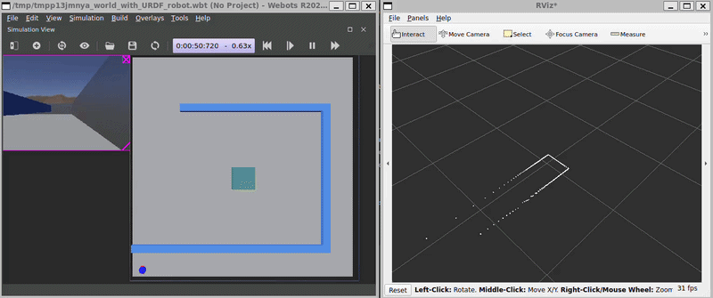

# ROS2 Webots LIDAR Sim — Autonomous Robot Navigation Plugin

A ROS 2 plugin for autonomous robot control with real-time obstacle avoidance in the Webots simulation environment.



## Overview

LIDAR Sim implements an intelligent differential-drive robot capable of navigating environments with dynamic obstacle detection. The robot processes LIDAR sensor data to identify obstacles and autonomously adjusts its trajectory to avoid collisions while responding to velocity commands.

## Technical Stack

- **Framework**: ROS 2 (Jazzy), Webots Robotics Simulator
- **Language**: C++14, Python
- **Build System**: ament_cmake (CMake 3.5+)
- **Key Dependencies**: rclcpp, pluginlib, webots_ros2_driver, geometry_msgs, sensor_msgs, tf2_ros

## Implementation Highlights

### Obstacle Detection Algorithm
- Processes 360° LIDAR scan data and segments into three sectors
- Identifies minimum distance to obstacles in front (±20°), left (>20°), and right (<-20°)
- Triggers avoidance logic when front obstacle detected within 0.25m safety threshold

### Autonomous Navigation Logic
```cpp
if (front_distance_ < safe_distance) {
    // Obstacle ahead
    if (left_distance_ > right_distance_) {
        // More space on left ...
    } else {
        // More space on right ...
    }

} else {
    // Keep going straight ...
}
```

## Project Structure
```
lidar_sim/
├── src/webot.cpp                   # Robot controller implementation
├── include/lidar_sim/webot.hpp     # Plugin interface header
├── launch/robot_launch.py          # ROS 2 launch configuration
├── resource/my_robot.urdf          # Robot URDF definition
├── worlds/my_world.wbt             # Webots simulation environment
├── CMakeLists.txt                  # Build configuration
└── package.xml                     # ROS 2 package metadata
```

## Build & Run

```bash
# Build the package
colcon build

# Source the install environment
source install/setup.bash

# Launch the simulation
ros2 launch lidar_sim robot_launch.py

# Send velocity commands
ros2 topic pub --once /cmd_vel geometry_msgs/Twist "{linear: {x: 0.1, y: 0.0, z: 0.0}, angular: {x: 0.0, y: 0.0, z: 0.0}}"
```
---
