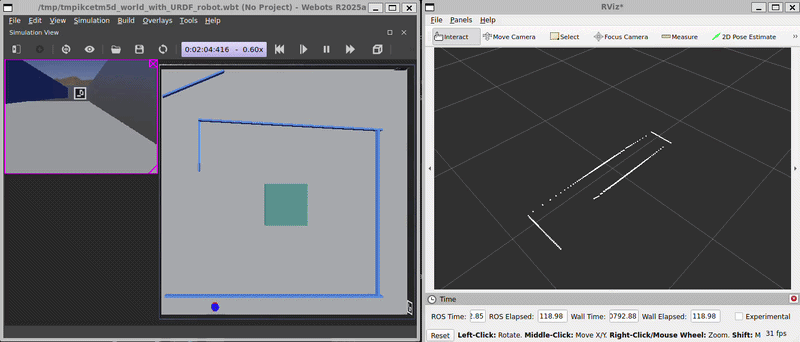
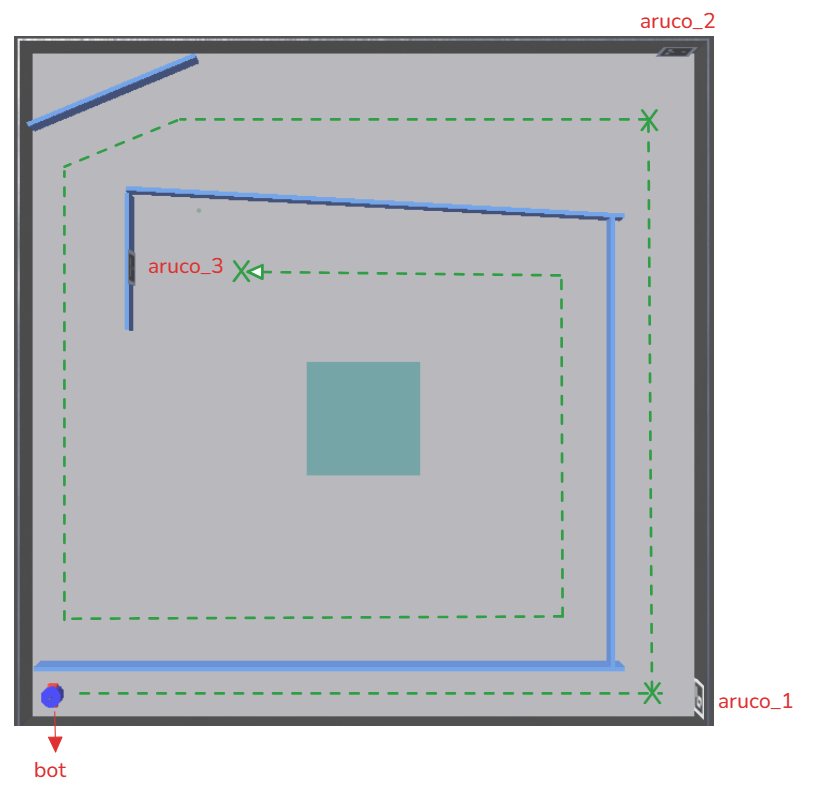

[](https://github.com/mihir-robotics/ros2_webots/actions/workflows/ci.yml)
# ROS2 Webots LIDAR Sim — Autonomous Robot Navigation Plugin

A ROS 2 package that implements an autonomous differential-drive robot controller for the [Webots](https://cyberbotics.com/) simulation environment. The robot uses LIDAR data for obstacle avoidance and a camera with ArUco marker detection to determine when to stop.



## Overview

`lidar_sim` is a `webots_ros2_driver` plugin package. It provides:

- A `webots_ros2_driver` plugin (`bot::webot`) that controls a differential-drive robot's motors based on incoming velocity commands and LIDAR scan data.
- An internal camera node (`bot::cameraNode`) that detects ArUco markers from a camera feed and publishes the detected marker ID.
- A custom `Vel` message type for sending linear and angular velocity commands to the robot.
- A Webots world (`my_world.wbt`) consisting of a walled corridor arena with ArUco marker signs placed at navigable locations.

The robot reads LIDAR scan data and partitions the field of view into three sectors — front (±20°), left (>20°), and right (<−20°). When an obstacle is detected within 0.3 m in the front sector, the robot steers toward whichever side has more clearance. If an ArUco marker with ID 14 is detected by the camera, the robot stops completely.



## Package Contents

```
lidar_sim/
├── src/
│   ├── webot.cpp           # webots_ros2_driver plugin: motor control, LIDAR-based obstacle avoidance, ArUco stop logic
│   └── camera_node.cpp     # Internal ROS 2 node: subscribes to camera image, detects ArUco markers, publishes marker ID
├── include/lidar_sim/
│   ├── webot.hpp           # Plugin class declaration
│   └── camera_node.hpp     # Camera node class declaration
├── launch/
│   └── robot_launch.py     # Launch file: starts Webots, the driver node, and a static TF publisher
├── msg/
│   └── Vel.msg             # Custom velocity message (float64 linear, float64 angular)
├── resource/
│   └── bot.urdf            # Robot URDF: maps the Lidar and Camera Webots devices to ROS topics and loads the plugin
├── worlds/
│   ├── my_world.wbt        # Webots simulation world (R2022b)
│   ├── aruco_0.png         # ArUco marker textures used in the world
│   ├── aruco_1.png
│   └── aruco_2.png
├── bot.xml                 # pluginlib plugin description file
├── CMakeLists.txt
└── package.xml
```

## Dependencies

The following packages are required. They are declared in `package.xml` and can be installed via `rosdep`.

| Dependency | Role |
|---|---|
| `rclcpp` | ROS 2 C++ client library |
| `sensor_msgs` | `LaserScan` and `Image` message types |
| `std_msgs` | `Int32` message type for ArUco marker ID |
| `webots_ros2_driver` | Webots–ROS 2 driver and plugin interface |
| `pluginlib` | Plugin loading infrastructure |
| `cv_bridge` | Converts ROS image messages to OpenCV `Mat` |
| `libopencv-dev` | OpenCV, used for ArUco marker detection |
| `rosidl_default_generators` | Generates C++ typesupport for `Vel.msg` |

Install all dependencies from the workspace root:

```bash
rosdep install --from-paths src --ignore-src -r -y
```

## Building

```bash
cd <your_ws>
colcon build --packages-select lidar_sim
source install/setup.bash
```

## Running

Launch the simulation (opens Webots with the bundled world and starts the robot driver):

```bash
ros2 launch lidar_sim robot_launch.py
```

The launch file starts three processes:

1. **Webots** — loads `worlds/my_world.wbt` in realtime GUI mode.
2. **`webots_ros2_driver` driver node** — loads the `bot::webot` plugin via `resource/bot.urdf`.
3. **`static_transform_publisher`** — publishes a static identity transform from `map` to `lidar`.

Webots will shut down all launched processes when its window is closed.

## Topics

### Subscribed

| Topic | Type | Description |
|---|---|---|
| `/bot/velocity` | `lidar_sim/msg/Vel` | Linear and angular velocity command. QoS: reliable, sensor data profile. |
| `/bot/scan` | `sensor_msgs/msg/LaserScan` | LIDAR scan data from the Webots Lidar device. QoS: best effort, sensor data profile. |
| `/aruco/marker_id` | `std_msgs/msg/Int32` | Detected ArUco marker ID, published internally by `camera_node`. QoS: best effort, sensor data profile. |
| `camera/image_raw/image_color` | `sensor_msgs/msg/Image` | Raw color camera image from the Webots Camera device (subscribed by the internal `camera_node`). QoS: best effort, sensor data profile. |

### Published

| Topic | Type | Description |
|---|---|---|
| `/aruco/marker_id` | `std_msgs/msg/Int32` | ID of the first ArUco marker detected in the current camera frame. Published by the internal `camera_node`. QoS: best effort, sensor data profile. |

## Messages

### `lidar_sim/msg/Vel`

```
float64 linear   # Forward speed in m/s
float64 angular  # Rotational speed in rad/s
```

Used to command the robot's differential-drive motors. Motor wheel velocities are derived from the standard differential-drive kinematic equations using a wheel radius of 0.025 m and a half-distance between wheels of 0.045 m.

## Plugin

The package exports one `webots_ros2_driver::PluginInterface` plugin:

| Class | Library |
|---|---|
| `bot::webot` | `lidar_sim_lib` |

The plugin is declared in `bot.xml` and is loaded by the driver node through the URDF (`resource/bot.urdf`).

## Sending Velocity Commands

While the simulation is running, velocity commands can be sent from the command line:

```bash
# Move forward at 0.2 m/s
ros2 topic pub --once /bot/velocity lidar_sim/msg/Vel "{linear: 0.2, angular: 0.0}"

# Turn in place
ros2 topic pub --once /bot/velocity lidar_sim/msg/Vel "{linear: 0.0, angular: 0.5}"
```

The robot will autonomously override the commanded velocities to avoid obstacles detected within 0.3 m. It will stop completely and ignore velocity commands when ArUco marker ID 14 is detected by the camera.

---
